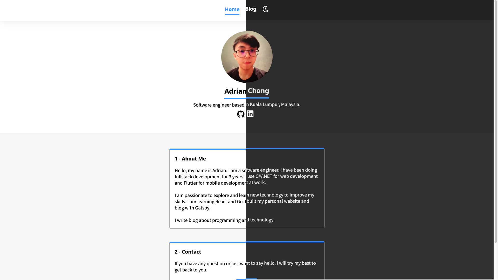

# adrianchongsf.com
[](https://app.netlify.com/sites/adrianchongsf/deploys)

My personal website using [Gatsby](https://www.gatsbyjs.com/).



## Prerequisite
- node
- npm

## Build
```bash
git clone https://github.com/sfchong/personal-web-gatsby
cd personal-web-gatsby
npm install
```

To run locally
```bash
npm start
```

To build production
```bash
npm run build 
npm run serve
```

## Deployment
This website is automatically built and deployed to netlify once commit/merge to `main`.

## Overview
This website uses Sass for styling with [Sass Module System](https://sass-lang.com/blog/the-module-system-is-launched). No CSS framework / UI Library is used.

All the blog post are written in markdown under `src/markdowns`. The blog post list and content page is built under `gatsby-node.js` `createPages` API. The markdowns are retrieved by graphql and all pages are built during build time.

Site metadata is stored in `gatsby-config.js`.

Search Engine Optimization (SEO) components under `src/components/seo.js` will insert all the SEO related header tags to HTML using `react-helmet`.

**Update 1 Jan 2022:** Migrated from Javascript to Typescript.

## Blog Post
You can read my blog post if you are interested in how I build this website.
- [Building My Website with Gatsby](https://adrianchongsf.com/blog/building-my-website-with-gatsby)