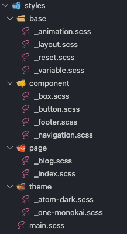
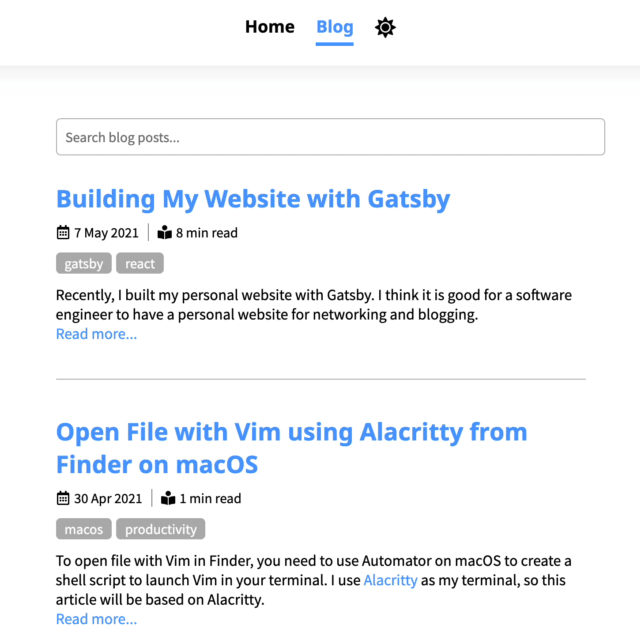
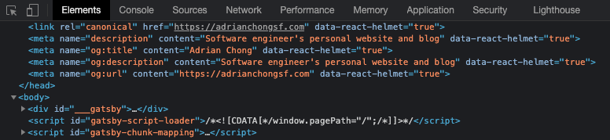

Recently, I built my personal website with [Gatsby](https://www.gatsbyjs.com/). I think it is good for a software engineer to have a personal website for networking and blogging. 

I decided to use Gatsby because I want to try a static site generator which has blazingly fast performance. Gatsby is one of the most popular static site generator with large community and huge number of plugin. I think it is a good idea to start with Gatsby since I know React.

## Features
I want to keep my website simple and minimal. For the first version, I decided to only build these 4 features:
1. A simple homepage to introduce myself
2. A blog which allow me to publish with markdown file
3. Search feature in blog
4. Toggle between light and dark theme

## Getting Started
Before start, you need to have NodeJs install. You can download NodeJs from [Official Website](https://nodejs.org/). For me I like to use [nvm](https://github.com/nvm-sh/nvm) which is a version manager for Node to install NodeJs.

I also recommend you to install gatsby cli which make running gatsby command easier.
```shell
npm install -g gatsby-cli
```

To create gatsby site run 
```shell
npm init gatsby
```
It will let you create gatsby interactively. You can pick which plugin/starter you want like typescript, markdown, sass, cms etc.

Once done, cd into the folder and run
```shell
gatsby develop
```

It will run gatsby in your local machine. Navigate to `http://localhost:8000/` in your browser you will see Gatsby site running.

You can visit [Gatsby Documentation](https://www.gatsbyjs.com/docs) for more details.

## Sass
For this website, I didn't use any UI library. All styling written in pure CSS. I use Sass to organize my css and allow css to be reusable. 

I keep all the css variable in `_variable.scss`. And seperate scss file by page and components. 

`main.scss` load all the file. I just need to import `main.scss` in my `layout.js`. 
```js
import "../styles/main.scss"
```



## Layout Component with wrapPageElement
I placed both header and footer in layout page components. 

```js
import React from "react"
import "../styles/main.scss"
import Header from "./header"
import Footer from "./footer"

const Layout = (props) => {
  return (
    <div>
      <Header />
      <main className="site-wrapper">{props.children}</main>
      <Footer />
    </div>
  )
}

export default Layout
```

By default Gatsby will re-render the whole page when route change. You can put the Layout component in `wrapPageElement` API in `gatsby-ssr.js` and `gatsby-browser.js` to keep your header and footer persistent while route changes.

I create a new file `wrapPageElement.js` at root.
```js
import React from "react"
import Layout from "./src/components/layout"

const wrapPageElement = ({ element, props }) => {
  return <Layout {...props}>{element}</Layout>
}

export default wrapPageElement
```

Then import it in `gatsby-browser.js` and `gatsby-ssr.js`
```js
import CustomLayout from "./wrapPageElement"

export const wrapPageElement = CustomLayout
```

## Dark Theme

Implementing dark theme is pretty straight forward. You would need to define the dark theme color in CSS. Create a `.dark` class and include the dark theme css in the class. Below is a snippet of css in my `_index.scss` file.
```css
.icon-link {
  font-size: 1.8rem;
  color: black;
  margin-right: 10px;
}

.icon-link:hover {
  color: $light-blue;
}

.section-intro {
  background-color: hsl(0, 0%, 97%);
  padding: 10px;
  font-size: 1.2rem;
}

.dark {
  .icon-link {
    color: white;
  }

  .icon-link:hover {
    color: $light-blue;
  }

  .section-intro {
    background-color: hsl(0, 0%, 22%);
  }
}
```

Then create a toggle button in header.
```jsx
<header>
  <nav>
    <ul>
      <li>
        <button
          className="btn-theme-toggle"
          onClick={this.props.toggleDarkMode}
          aria-label="theme-toggle"
        >
          {this.props.darkMode ? <FaRegMoon /> : <FaSun />}
        </button>
      </li>   
    </ul>
  <nav/>  
</header>
```

Next, create a `toggleDarkMode` function in Layout page to modify the dark mode state, then pass the function to `Header` component. It will insert `.dark` css class to your html root if it is dark mode.
```js
const Layout = (props) => {
  const [darkMode, setDarkMode] = React.useState(false)

  React.useEffect(() => {
    // get user preference from browser local storage
    let preferDark = localStorage.getItem("darkMode")

    if (preferDark == null) {
      // if user preference not found, check system default
      preferDark =
        window.matchMedia &&
        window.matchMedia("(prefers-color-scheme: dark)").matches
    } else {
      preferDark = preferDark === "true"
    }

    setDarkMode(preferDark)
  }, [darkMode])

  const toggleDarkMode = () => {
    // save user preference to local storage
    localStorage.setItem("darkMode", !darkMode)

    setDarkMode((prev) => !prev)
  }

  return (
    <div className={darkMode ? "dark" : ""}>
      <Header darkMode={darkMode} toggleDarkMode={toggleDarkMode} />
      <main className="site-wrapper">{props.children}</main>
      <Footer />
    </div>
  )
}

export default Layout
```

## Markdown Page
You can query markdown data using GraphQL. First you need to install transformer plugin and add it to `gatsby-config.js`
```shell
npm install gatsby-transformer-remark
```

Once installed the plugin, you can put frontmatter data at the top of your markdown file in triplet dashes block (---). These data can be query by GraphQL and be used in page generation. 
```md
---
title: "Building My Website with Gatsby"
slug: "building-my-website-with-gatsby"
date: "2021-05-07"
tags: ["gatsby", "react"]
---

# Title
This is my markdown file.
```

You can use GraphiQL (GraphQL IDE) to test your GraphQL query in `http://localhost:8000/___graphql`

I use `createPages` node API in `gatsby-node.js` to create all the markdown pages during build time. You only need to query the markdown files one time, then pass the data to `createPage` via context.

Below is my `gatsby-node.js` snippet
```js
exports.createPages = async ({ actions, graphql, reporter }) => {
  const { createPage } = actions

  const blogListTemplate = require.resolve(
    `./src/templates/blogListTemplate.js`
  )

  const blogPostTemplate = require.resolve(
    `./src/templates/blogContentTemplate.js`
  )

  const result = await graphql(`
    {
      allMarkdownRemark(
        sort: { order: DESC, fields: [frontmatter___date] }
        filter: { frontmatter: { slug: { ne: null } } }
      ) {
        nodes {
          id
          html
          timeToRead
          excerpt(pruneLength: 200)
          frontmatter {
            slug
            title
            date(formatString: "D MMM YYYY")
            fromNow: date(fromNow: true)
            tags
          }
        }
      }
    }
  `)

  // Handle errors
  if (result.errors) {
    reporter.panicOnBuild(`Error while running GraphQL query.`)
    return
  }

  // Create blog list page (/blog)
  if (result.data.allMarkdownRemark.nodes) {
    createPage({
      path: "blog",
      component: blogListTemplate,
      context: {
        // pass data to template via context
        nodes: result.data.allMarkdownRemark.nodes,
      },
    })
  }

  // Create blog content page (/blog/{slug})
  result.data.allMarkdownRemark.nodes.forEach(
    ({ html, timeToRead, frontmatter, excerpt }) => {
      createPage({
        path: "blog/" + frontmatter.slug,
        component: blogPostTemplate,
        context: {
          // pass data to template via context
          html: html,
          timeToRead: timeToRead,
          frontmatter: frontmatter,
          excerpt: excerpt,
        },
      })
    }
  )
}
```

In your template component, use `dangerouslySetInnerHTML` to set your markdown html.

Below is my `blogContentTemplate.js`
```js
export default function Template({ pageContext }) {
  const { frontmatter, html, timeToRead, excerpt } = pageContext

  return (
    <div className="content-wrapper">
      <div className="blog-top-wrapper">
        <h1 className="blog-title">{frontmatter.title}</h1>
        <div className="blog-date-container">
          <BlogDateIcon date={frontmatter.date} />
          <BlogTimeIcon timeToRead={timeToRead} />
        </div>
        <div>
          {frontmatter?.tags?.map((tag, index) => (
            <span key={index} className="blog-tag">
              {tag}
            </span>
          ))}
        </div>
      </div>
      <div
        className="blog-post-content"
        dangerouslySetInnerHTML={{ __html: html }}
      />
    </div>
  )
}
```

For code syntax hightlighting in markdown, I use [gatsby-remark-prismjs](https://www.gatsbyjs.com/plugins/gatsby-remark-prismjs/) plugin.

For image, I use [gatsby-remark-images](https://www.gatsbyjs.com/plugins/gatsby-remark-images/) plugin.

## Adding Search 
Before implementing search, make sure you have read [Adding Search](https://www.gatsbyjs.com/docs/how-to/adding-common-features/adding-search/) in Gatsby Documentation.

I use [JS Search](https://github.com/bvaughn/js-search) which is a client side search library. Since this is a client side search library, it can increase your bundle size which it not suitable if you have large amount of data. The benefit of it is it does not require any external search engine like ElasticSearch or Algolia which you will need to pay. 

To install run:
```shell
npm install js-search
```

Since I had passed in the data to `blogListTemplate.js`, I can get my markdown list from `pageContext`. Then, add field which you want to index, for me is `frontmatter.title`
```js
const BlogListPage = ({ pageContext }) => {
  // define states which will be used for searching
  const [search, setSearch] = React.useState(null)
  const [term, setTerm] = React.useState("")
  const [queryResult, setQueryResult] = React.useState([])

  // search event which bind to textbox onchange
  const searchEvent = (e) => {
    const searchTerm = e.target.value

    // display all data if there is no input
    const result =
      searchTerm === "" ? pageContext.nodes : search.search(searchTerm)

    // update state
    setTerm(searchTerm)
    setQueryResult(result)
  }

  React.useEffect(() => {
    // blogs is the list of markdown I pass in from createPage in gatsby-node.js
    const blogs = pageContext.nodes
    const jsSearch = new JsSearch.Search("id")

    // add index for searching
    jsSearch.addIndex(["frontmatter", "title"])
    // add data source
    jsSearch.addDocuments(blogs)

    // update state
    setSearch(jsSearch)
    setQueryResult(blogs)
  }, [pageContext])

  return (
    <div className="content-wrapper">
      <section className="blog-list-wrapper">
        <input
          className="blog-search-textbox"
          id="Search"
          value={term}
          onChange={searchEvent}
          placeholder="Search blog posts..."
          autoComplete="off"
        />
        {queryResult?.map(({ id, html, timeToRead, frontmatter }) => (
          <BlogList
            key={id}
            timeToRead={timeToRead}
            frontmatter={frontmatter}
            html={html}
          />
        ))}
      </section>
    </div>
  )
}

const BlogList = ({ timeToRead, frontmatter, html }) => {
  return (
    <div className="blog-list-item-wrapper">
      <Link to={"/blog/" + frontmatter.slug}>
        <p className="blog-title ">{frontmatter.title}</p>
      </Link>
      <div className="blog-date-container">
        <BlogDateIcon date={frontmatter.date} />
        <BlogTimeIcon timeToRead={timeToRead} />
      </div>
      <div className="blog-tag-container">
        {frontmatter?.tags?.map((tag, index) => (
          <span key={index} className="blog-tag">
            {tag}
          </span>
        ))}
      </div>
    </div>
  )
}

export default BlogListPage
```

## Adding SEO
Adding page meta tags can improve search engine optimization (SEO), which will help the website rank better in search engines.

To insert meta tags to HTML in Gatsby, we will need `gatsby-plugin-react-helmet` plugin.
```shell
npm install gatsby-plugin-react-helmet react-helmet
```

Create a new component in `seo.js`. You can query siteMetaData from `gatsby-config.js` with `useStaticQuery` in `seo.js`.
```js
import React from "react"
import PropTypes from "prop-types"
import { Helmet } from "react-helmet"
import { useStaticQuery, graphql } from "gatsby"
import socialBanner from "../images/og-image.png"

const SEO = ({ title, description, url }) => {
  const { site } = useStaticQuery(query)

  const {
    defaultTitle,
    titleTemplate,
    defaultDescription,
    siteUrl,
  } = site.siteMetadata

  const seo = {
    title: title || defaultTitle,
    description: description || defaultDescription,
    url: url ? `${siteUrl}/${url}` : siteUrl,
  }

  return (
    <Helmet
      title={title}
      titleTemplate={titleTemplate}
      defaultTitle={defaultTitle}
      htmlAttributes={{
        lang: "en",
      }}
      link={[
        {
          rel: "canonical",
          href: seo.url,
        },
      ]}
      meta={[
        {
          name: "description",
          content: seo.description,
        },
        {
          name: "og:title",
          content: seo.title,
        },
        {
          name: "og:description",
          content: seo.description,
        },
        {
          name: "og:url",
          content: seo.url,
        },
        {
          property: "og:type",
          content: "website",
        },
        {
          property: "og:image",
          content: socialBanner,
        },
      ]}
    ></Helmet>
  )
}

export default SEO

SEO.propTypes = {
  title: PropTypes.string,
  description: PropTypes.string,
  image: PropTypes.string,
}

SEO.defaultProps = {
  title: null,
  description: null,
  image: null,
}

const query = graphql`
  query SEO {
    site {
      siteMetadata {
        defaultTitle: title
        titleTemplate
        defaultDescription: description
        siteUrl: url
      }
    }
  }
`
```

The og tags like `og:title` are Open Graph meta tags which controls how your website link is displayed in social media.

Once done, you can use SEO component in all of your page. You can customize this component to fit your usage.
```js
return (
  <div>
    <Seo title="Blog" description="This a my blog." url="blog" />
    <div>
      Your page content go here...
    </div>
  </div>
)
```

You can check whether the tags are inserted correctly to HTML head in your browser by inspecting the website. 



---
If you want to know more you can visit my [Github Repo](https://github.com/sfchong/personal-web-gatsby).