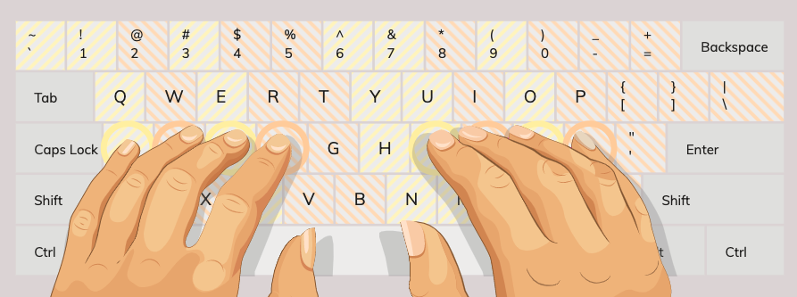
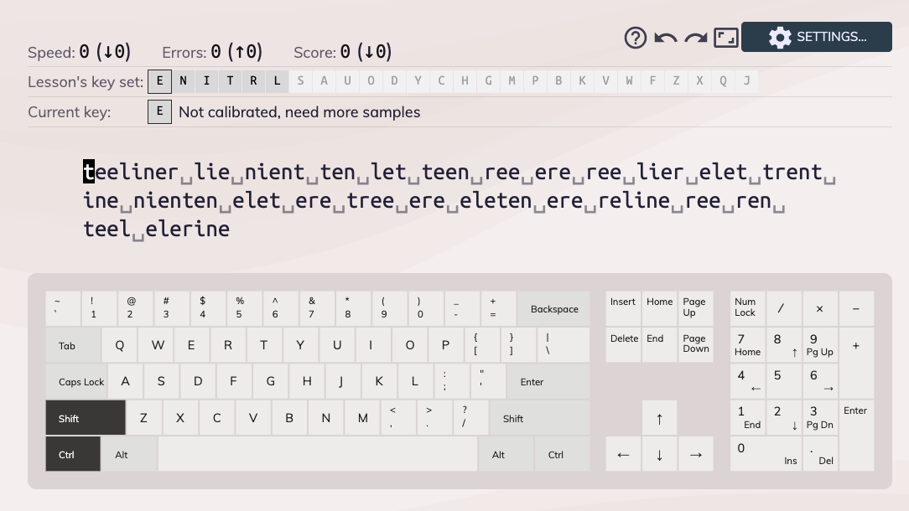
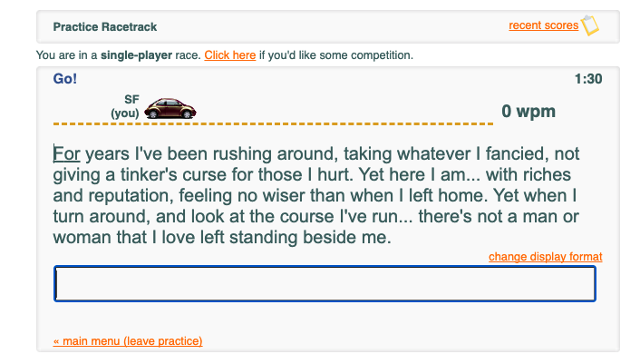
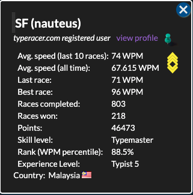
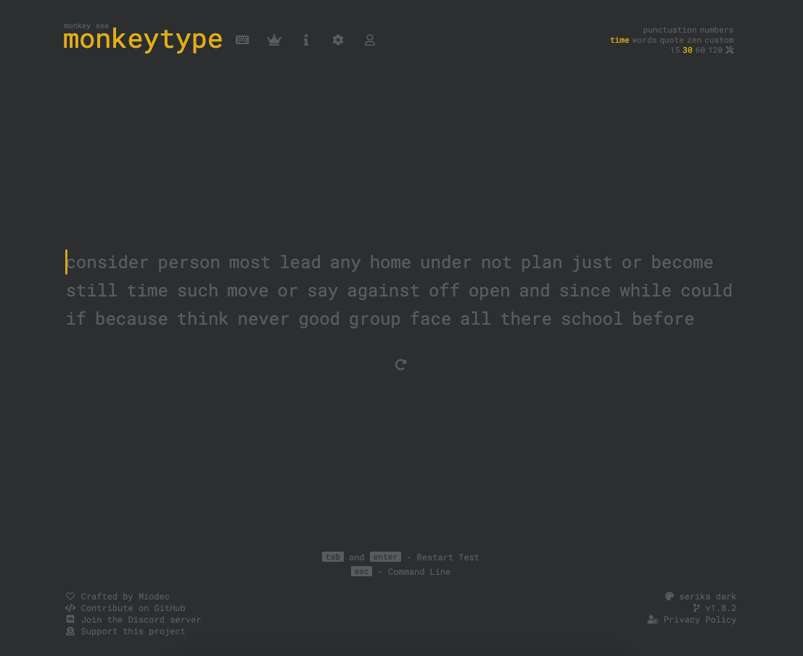
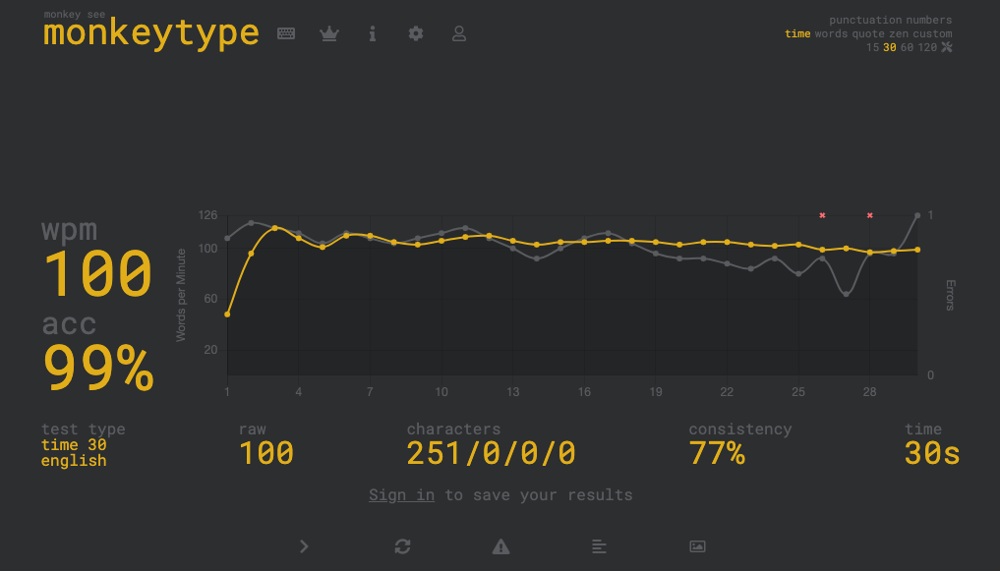

I was a terrible typer. I never knew how to type properly since I know how to use a computer. Over the years I have developed my own way to type. I was using only 2 or 3 fingers on each hand, and position randomly on the keyboard. It was bad and inefficient since I have to constantly look at the keyboard and not fully utilising all the fingers. I believe my max typing was about 40 to 50 wpm (word per minute).

## My Goal 🎯
Two years ago, I decided to learn how to type properly. My goal was able to touch type using all of my fingers, and achieve typing speed of 80 wpm. I saw some people can easily type over 100 wpm, but I wanted to set an achievable target for myself first.

## What is Touch Typing ❓
Touch typing is a style of typing without looking at the keyboard. The typing just come out naturally based on typist's muscle memory. For touch typing you will to place ur fingers on the home row of the keyboard which is "ASDF" for the left hand and "JKL;" for the right hand. Each finger is responsible for specific keys.

## Why I Decided to Learn Touch Type ❓
The reason I decided to learn touch type was because I believed it can increase my productivity as a software developer since I use my keyboard for my job all day long. Activities like coding, writing document, email, google search involve typing. I think it will definitely save my time in the long run.

Second reason was I wanted to use [Vim](https://en.wikipedia.org/wiki/Vim_(text_editor)) efficiently. Vim's keybind is designed with touch typing in mind, which you put your fingers on the home row of the keyboard, left index finger on F key and right index finger on J key. My typing was really slowing me down while I was using vim.

Another reason is I feel bad about typing slow on a nice mechanical keyboard... 😅

## How I learn 
Well. How did I start? I was researching on the Internet. The most helpful one I found was [Keybr](https://www.keybr.com/). 

### Keybr

It is an interesting website since it uses a unique approach to teach typing. It has an algorithm to generate typing lessons matching your skills. If your typing speed is slow, it will generate random word by less amount of letter. You will not get overwhelmed by long or difficult word at the beginning. As you progress and able to type faster, it will add more letter to the word generation. You can  have a progressive learning experience until you are able to touch type all the 26 letters. 

If you made a typo, the incorrect keystroke wouldn't register. You can ignore your typo and proceed by typing the correct letter. It lets you focus on your typing so that you don't have to waste time correcting your typo. Of course you need to have a decent accurary to progress, but occasionally a couple of mistake is fine.

After few weeks learning on Keybr, I was able to touch type all 26 letters. The feeling was magical. The typing came out intuitively by muscle memory. Did I satisfied on my progress? Not yet. There are a couple of things I need to work on.

On Keybr default setting, there are few things were turned off to make it easier for beginner. First, capital letters, punctuation and numbers are turned off. I still need to learn how to type these. Another thing is Keybr is too error forgiving. It lets you ignore your typo. It won't work in real world typing as you need to correct your typo by pressing backspace. You can adjusting the setting in Keybr, but I was bored as I had been typing on Keybr for two months.

Another problem is even though I learnt touch type on Keybr, but I haven't completely switch from my "bad typing method" to touch typing. I can touch type properly on Keybr, but once left Keybr and back to my work, I still use back my own typing method. The transition period is painful as my fingers are fighting with my brain. I realized I need to fully learn how to type capital letters, punctuation and numbers so that I can completely replace my own typing method with touch typing.

### TypeRacer
After a two months on Keybr, I switch to [TypeRacer](https://play.typeracer.com/). I found that it is more fun. On TypeRacer you can compete typing with your friend or other online user. Playing on TypeRacer made me realized it is still a long way for me to hit my target of 80 wpm. On Keybr I can type 60 wpm, but typing on TypeRacer my typing speed dropped to average of 40 wpm. Unlike Keybr which generates random words, TypeRacer uses text from books, quotes, and songs.

Playing on TypeRacer is more challenging than Keybr. I learnt how to learn capital letters, punctuation and numbers on TypeRacer by playing with other people online. The people playing on TypeRacer is really good. I had played with people who can type 160 wpm in a game. It is not easy to win on TypeRacer but I primarily focus on improving my typing. Win rate is not a big deal for me even though I lost a lot of games on TypeRacer at the beginning. Sometimes I will just play the practice mode since it has less loading time (3 seconds) than normal typing race (10 seconds).

I improved my typing a a lot after playing on TypeRacer for a few months. I  spent 10 to 15 minutes a day to type. After few months I was able to ditch my old typing method and completely switch to touch typing. Now, my average typing speed on TypeRacer is 70+ wpm, best at 96 wpm.

### Monkeytype
Now I occasionally use [Monkeytype](https://monkeytype.com/) to type for fun. In my opinion it has the best UI among all the typing website. It is clean, minimal, has many color themes and the setting is high customizable. I found its dark theme is very pleasing for my eyes. Most importantly, it is open source on [Github](https://github.com/Miodec/monkeytype)! As a software developer I always love open source software.

I usually type on default setting 30 seconds with average 80 to 90 wpm. Sometimes with good form i can get over 100+ wpm. If I need something more challenging I will just go back to TypeRacer.

## Does It Improved Productivity
Does touch typing improve productivity? Definitely. Does it improve by a lot? It depends on what type of work you are doing.

I spend most of my time on coding. Surprisingly I feel like it doesn't help on coding significantly since you spend more time on thinking rather than typing. IDE or smart text editor like VSCode has features like autocomplete, code snippet and refactoring which help you to reduce typing.

Touch typing shines when comes to writing document, email, blog and even google search.

## Typing Tips 💡
I would like to share a few typing tips. 

If you feel like you reach a point where it is hard to improve your wpm, try to slow down and type accurately. This really helps me a lot. If you rush to type fast and made typo, you need time to correct your typo which will slow you down. You need to work on your accuracy first, speed will come later.

You can press `Ctrl+Backspace` on Windows or `Option+Delete` on Mac to delete a word rather than pressing down `Backspace` or `Delete`. This way you can correct your typo faster.

From my experience, sometimes it is ok to tweak your fingering a little bit by hitting the key with different finger for certain word if you feel more comfortable that way. For example, when I type the word "maybe", I use my left index finger to type "y" then follow by right index finger to type "b". I know some people never use their right pinky, but still able to type at 100+ wpm.

For keyboard choice, I would say it is up to personal preference. Personally, I like to use mechanical keyboard. You can just use your laptop keyboard or a membrane keyboard. You can give mechanical keyboard a try and see if you like it. If you can afford one it is definitely worth it.

Lastly, I advice you do not spend too much time on practicing typing in a day. I recommend max 15 to 20 minutes a day. You will gain very little by practicing more than 30 minutes a day.

## Summary
Learning touch typing is like learning a new skill and forming a new habit. It requires patience, determination and consistency. You need to put in your time to practice. Do it consistently for everyday for a few months then you will see the result. 

Does it worth your time to learn? I would say yes. Typing is a skill that will probably worth a lifetime in modern days, assuming physical keyboard won't be replaced so soon by another technology.

Now I am able to touch type at 70 to 90 wpm, depending on the difficulty of the text. It is not super impressive, but I am happy with it at the moment. I do not practice typing seriously anymore. I will play TypeRacer and Monkeytype occasionally for fun.

I am also aware of alternate keyboard layout like [Dvorak](https://en.wikipedia.org/wiki/Dvorak_keyboard_layout) and [Colemak](https://en.wikipedia.org/wiki/Colemak) which is more ergonomic and more efficient compared to traditional QWERTY keyboard layout. However, I don't think I am willing to spend my time and effort to learn another keyboard layout. I will just stick with QWERTY.

If you trying to start your journey to learn touch typing, good luck!

