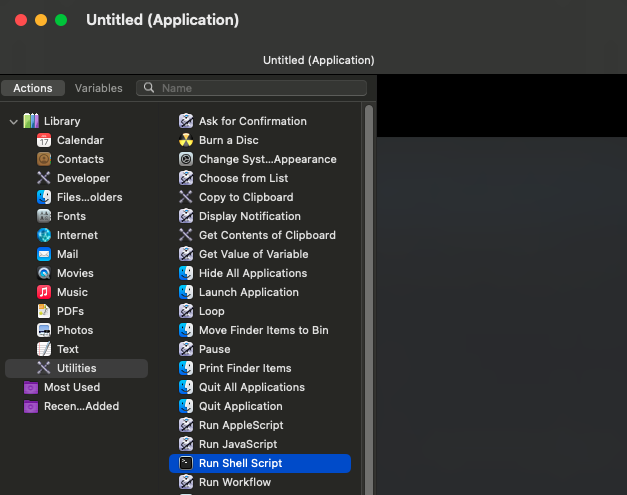
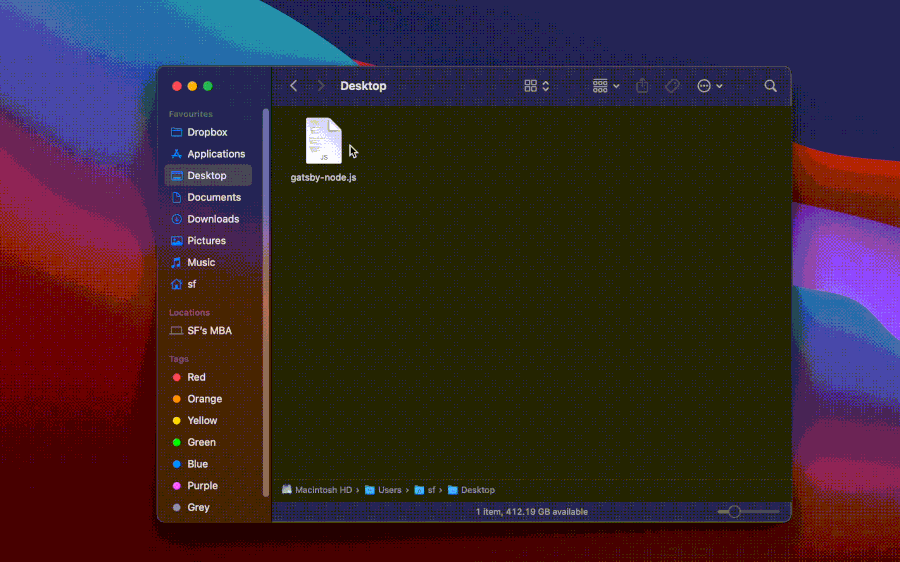

To open file with Vim in Finder, you need to use Automator on macOS to create a shell script to launch Vim in your terminal. I use [Alacritty](https://github.com/alacritty/alacritty) as my terminal, so this article will be based on Alacritty.

First, launch Automator, then go to File > New, then choose Application.

Go to Library > Utilities, doublie click on 'Run Shell Script'.



Next, paste in the following script.
```bash
for f in "$@"; do
    /opt/homebrew/bin/alacritty -e $SHELL -c "vim '$f'"
done 
```
 
It will take the selected file from parameter and run Alacritty with command `vim <myfile>`

Then save the file with your prefer name. For me I saved as FinderVim.app.

Done! You can replace the default app with your Automator FinderVim. From now you can double click on file in Finder to open with Vim.



Happy Vim-ing. 🧑🏻‍💻